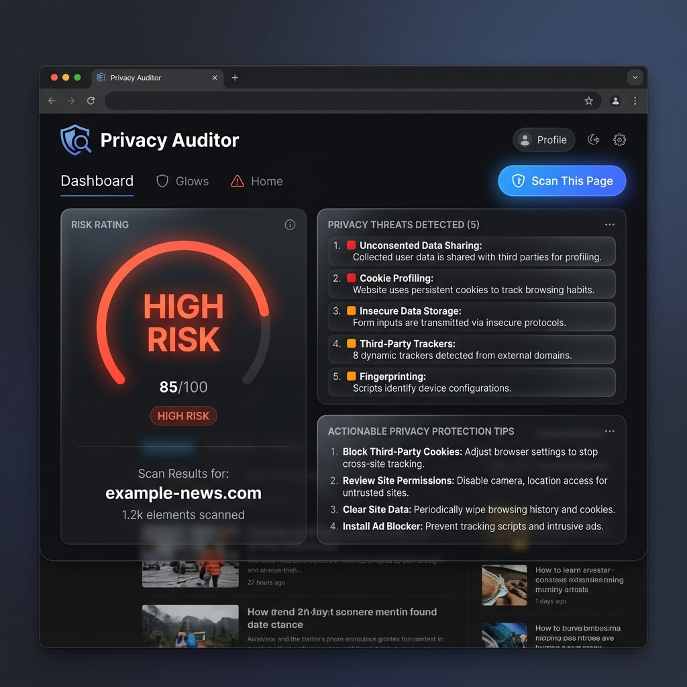
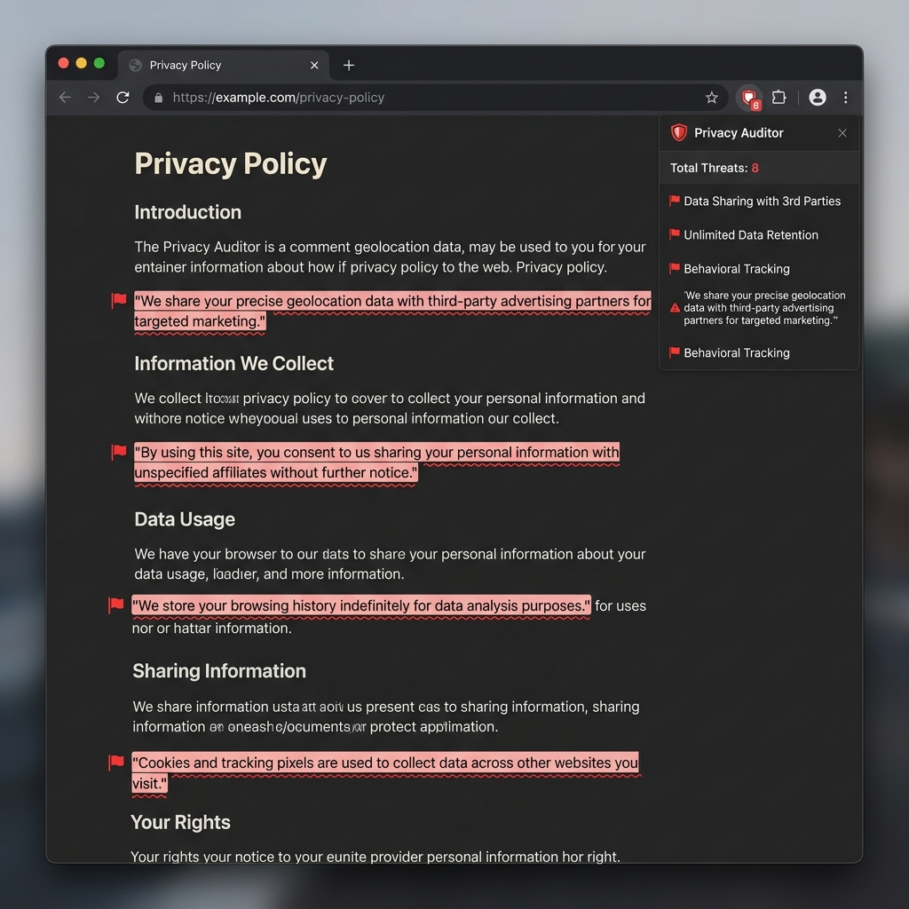

# Local Privacy Auditor 🛡️

A local, privacy-first Chrome Extension (Manifest V3) that scans privacy policies in real-time for data threats using **Chrome's built-in AI (Gemini Nano)** with a fallback **smart regex engine**.

It highlights red-flag clauses directly on the webpage, quotes the exact policy text for legal accuracy, evaluates risk levels, and suggests actionable protection steps. **100% of the analysis runs locally on your computer—zero data leaves your browser.**

---

## ✨ Features

- **🤖 Built-in Chrome AI (Gemini Nano)**: Runs local on-device AI analysis when enabled in Chrome flags.
- **⚡ Smart Regex Scanner**: Fallback scanner covering 11 critical privacy threat categories (data selling, AI model training, targeted ads, class action waivers, forced arbitration, contact book syncing, GPS tracking, and data retention).
- **🖍️ On-Page Highlight Marks**: Underlines flagged threat sentences directly on the live webpage in red.
- **📜 Direct Policy Quoting**: Displays exact quoted excerpts from the policy to ensure 100% factual accuracy and legal defensibility.
- **📊 Weighted Severity Rating**: Assigns `CRITICAL`, `HIGH`, `MODERATE`, `LOW`, or `SAFE` scores based on weighted risk metrics.
- **🛡️ Actionable Protection Tips**: Gives tailored, practical steps (e.g., how to opt out of AI training or disable location tracking).
- **🌙 Modern Dark UI**: Sleek, glassmorphism popup interface with severity badge indicators.

---

## 📸 Screenshots

| Extension Audit Overview | On-Page Red Flag Highlighting |
| :---: | :---: |
|  |  |

---

## 📖 Complete Step-by-Step Usage Guide

### 📥 Step 1: Get the Code on Your Computer

1. Open your terminal or command prompt.
2. Run the following command to clone the repository:
   ```bash
   git clone https://github.com/Abdulrahman4443/privatepolicy-reviewer.git
   ```
   *(Alternatively: Click the green **Code** button at the top of this GitHub page $\rightarrow$ Click **Download ZIP** $\rightarrow$ Extract the zip folder anywhere on your PC).*

---

### ⚙️ Step 2: Install into Google Chrome

1. Open **Google Chrome**.
2. Type `chrome://extensions/` into the address bar and press **Enter**.
3. In the top-right corner of the Extensions page, turn **ON** the **Developer mode** toggle switch.
4. Click the **Load unpacked** button that appears in the top-left corner.
5. In the file picker, select the `PrivacyAuditor` folder (or the cloned `privatepolicy-reviewer` folder).
6. Click **Select Folder**. The **Local Privacy Auditor 🛡️** extension will now appear in your list!
7. *(Recommended)* Click the **Puzzle Piece icon** in your Chrome top-right toolbar and click the **Pin 📌** icon next to Privacy Auditor to keep it visible.

---

### 🤖 Step 3: Enable Chrome's On-Device AI (Optional)

By default, the extension uses its **Smart Regex Engine** (which works instantly on all Chrome installations). To activate Chrome's built-in **Gemini Nano AI**:

1. In Chrome, type `chrome://flags/` in your address bar and press **Enter**.
2. Search for **Prompt API for Gemini Nano** $\rightarrow$ Change setting to **Enabled**.
3. Search for **Enables optimization guide on device** $\rightarrow$ Change setting to **Enabled BypassPrefRequirement**.
4. Click the **Relaunch** button at the bottom right to restart Chrome.

---

### 🔍 Step 4: How to Audit Any Privacy Policy

1. Open Chrome and visit any website's Privacy Policy page (for example: [OpenAI Privacy Policy](https://openai.com/privacy), Google, Facebook, etc.).
2. Click the **Privacy Auditor 🛡️** icon in your Chrome extension toolbar.
3. Click the blue **🔍 Scan This Page** button inside the popup.
4. **Watch the results appear:**
   - **Overall Risk Rating**: Displays a color-coded verdict card (`CRITICAL`, `HIGH`, `MODERATE`, `LOW`, or `SAFE`).
   - **Threats List**: Lists every privacy threat found along with the **exact quoted text** directly from that website's policy.
   - **Recommended Actions**: Shows tailored, actionable steps you can take (such as opting out of AI training or turning off location permissions).
   - **On-Page Red Highlights**: Look at the active webpage behind the popup—red-flag sentences are automatically highlighted with light-red badges and underlines so you can read them in full context!

---

## 🛠️ Project Structure

```
privatepolicy-reviewer/
├── manifest.json       # Chrome Manifest V3 extension configuration
├── popup.html          # Dark mode popup UI layout (Glassmorphism design)
├── popup.js            # UI script & communication controller
├── content.js          # Webpage DOM scraper & on-page red flag highlighter
├── background.js       # Background scanning engine (Gemini Nano AI + Regex engine)
├── README.md           # Documentation & step-by-step user guide
└── docs/screenshots/   # Visual demonstration assets
```

---

## 🔒 Privacy & Security Guarantee

This extension processes all text **100% locally** on your computer inside Chrome's secure sandbox. It contains **no network requests** (`fetch` / `XMLHttpRequest` / `API calls`) and sends zero data to external servers or third parties.

---

## 📜 Legal Disclaimer

*Local Privacy Auditor quotes privacy policy text for informational and educational purposes only. It does not constitute legal advice. Users should consult a qualified attorney for legal questions.*
